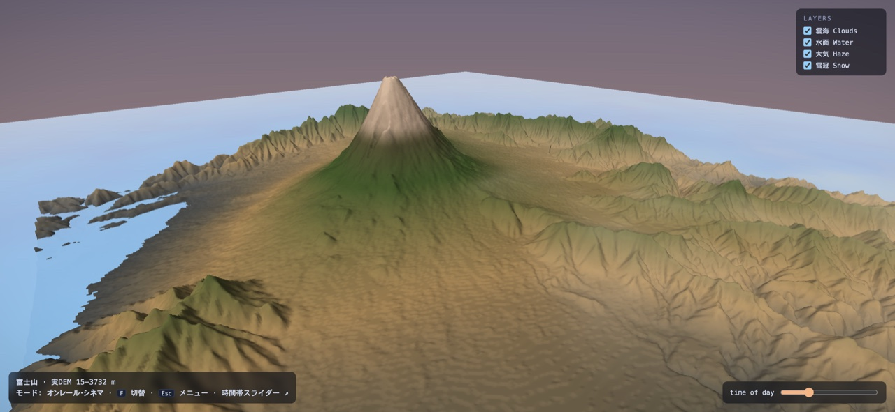
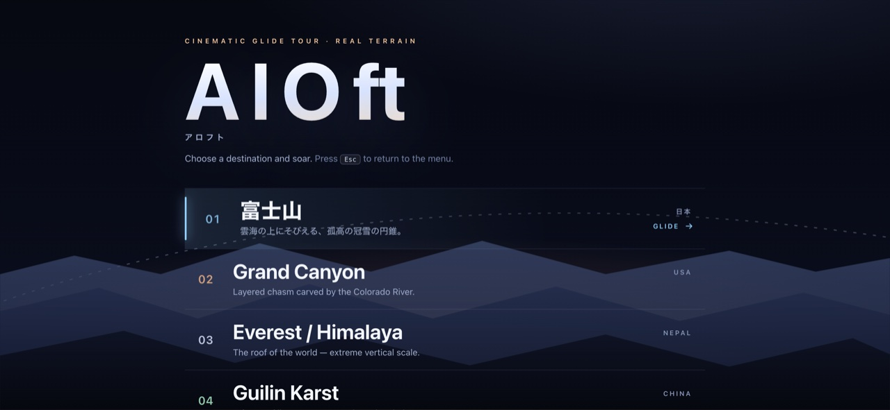

[日本語](./README.md) ・ [**English**](./README.en.md)

# WebGPU Iconic-Terrain Glide Tour (aloft-webgpu)

<!-- tech-stack:start (auto-generated) -->
<p align="center">
  
  
  
</p>
<!-- tech-stack:end -->

A Soarin'-style flight piece that renders **real DEM (elevation data)** as 3D terrain in WebGPU and
glides majestically over the world's iconic places. Pick a destination from the **Destinations** menu
and the glide begins. No backend; the runtime is network-free (terrain is bundled, lightweight).

## Screenshots





## Destinations (5 places, all real DEM)
Fetched at build time from AWS Terrain Tiles (terrarium), elevation-decoded, and downsampled to a ~512² heightmap, then bundled.

| Place | Elevation range |
|---|---|
| Mount Fuji | 15–3732 m |
| Grand Canyon | 673–2766 m |
| Himalaya (around Everest) | 2193–8732 m |
| Guilin karst | 104–1268 m |
| Norwegian fjord | -2–1841 m |

> Where fetching isn't possible, it auto-falls back to a **procedural** approximation of each place.

## Flight (hybrid)
Default is an **on-rails cinematic glide** (a per-destination Catmull-Rom path). Press **F** to switch to
**free glide** (hang-glider controls: W/↑ climb, S/↓ dive). **Esc** returns to Destinations. The current place is kept in the URL hash (`#dest=fuji`).

## Effects
Cloud sea below · atmospheric haze (aerial perspective) · reflective water (lakes, rivers, fjords) ·
snow caps + elevation color · speed feel (wind streaks, FOV, light motion blur) · baseline directional
sun = **golden-hour default + time-of-day slider**.

## Stack
- **Rendering**: WebGPU (multi-pass: sky → terrain → water → clouds → postfx) + WGSL
- **Tooling**: Node-based DEM fetch/convert and fallback generation (`tools/`)
- **Setup**: plain ES modules, zero dependencies, no CDN. Fallback message when WebGPU is unavailable.

## Run & verify
In a WebGPU-capable browser:
```sh
python3 -m http.server 8096   # → http://localhost:8096/
```

```sh
for f in src/shaders/*.wgsl; do naga "$f"; done   # validate WGSL
for f in src/*.js; do node --check "$f"; done       # JS syntax
node tools/test_dem.mjs && node tools/test_mesh.mjs && \
node tools/test_flight.mjs && node tools/test_fallback.mjs   # unit tests (20)
```

To re-fetch the real DEM:
```sh
node tools/fetch_dem.mjs            # re-fetch and convert the 5 places
node tools/fetch_dem.mjs --fallback # use procedural generation instead
```
> The actual rendering and flight feel are confirmed visually in a WebGPU browser.
